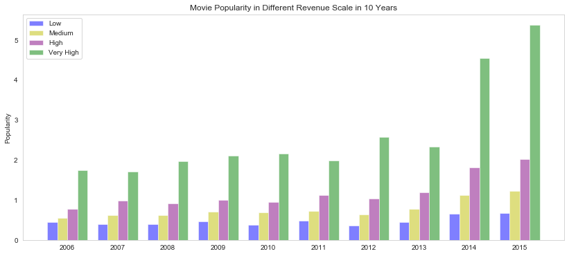

# Investigate a Movie Dataset
In this project, I go through the data analysis process and see how everything fits together. For this project I am using TMDb dataset and apply Data Analysis to figure out what exactly makes a movie a “success".

With the growing demand of new movies and the wide range of movie genres, analytics about the performance of movies can give useful information to studios so that they can make the most strategic decisions regarding production and financing.

## 1. Movie Demands Over Years

## 2. Movie Popularity in Different Revenue Scale

## 3. Distribution of Revenue in Different Score Rating Levels

## 4. Properties Associated with Movies that have high popularity

## 5. Number of Movies Released Over Years

## 6. Genres Trends by Generation

## Resources
* [What Makes a Movie Successful : Using Analytics
to Study Box Office Hits](https://trace.tennessee.edu/cgi/viewcontent.cgi?article=3282&context=utk_chanhonoproj)
* [Binning Data with Pandas qcut and cut](https://pbpython.com/pandas-qcut-cut.html)
* [How to quickly form groups (quartiles, deciles, etc) by ordering column(s) in a data frame](https://stackoverflow.com/questions/4126326/how-to-quickly-form-groups-quartiles-deciles-etc-by-ordering-columns-in-a)
* [Why are movies so popular?](https://www.quora.com/Why-are-movies-so-popular)
